Author: Ilton Garcia dos Santos Silveira
<br>
Date: December, 13, 2017        


# Heuristic Analysis for Planning Cargo

That analysis should expose it project results, showing:
1. The sequence of actions for each problem;
1. Comparing 3 uniformed planning algorithms for all 3 problems;
1. 2 heuristics used with A* search for planning on all 3 problems, from the planning graph;
1. Table of performances for each algorithm on each problem;
1. 1 reason for each result using the appropriate justification.


## The Sequence of Actions for each Problem & table of performance
Sequence of actions for each problem, comparing 3 uniformed planning algorithms for all 3 problems
with table of performances.

- Problem 1 initial state and goal:
    ```
    Init(At(C1, SFO) ∧ At(C2, JFK)
    ∧ At(P1, SFO) ∧ At(P2, JFK)
    ∧ Cargo(C1) ∧ Cargo(C2)
    ∧ Plane(P1) ∧ Plane(P2)
    ∧ Airport(JFK) ∧ Airport(SFO))
    Goal(At(C1, JFK) ∧ At(C2, SFO))
    ```
    - RESULT: Problem 1 - astar_search with h_1
    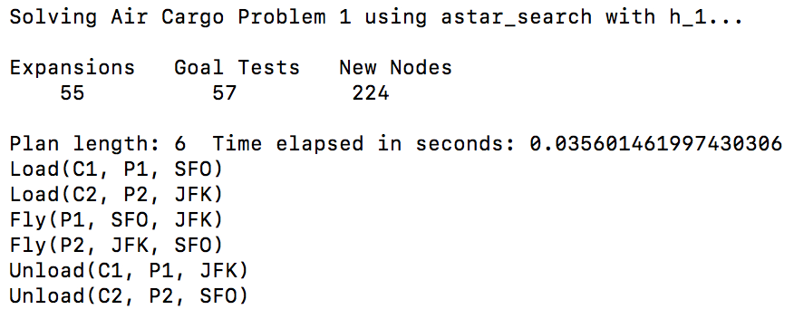
    - RESULT: Problem 1 - depth first graph search
    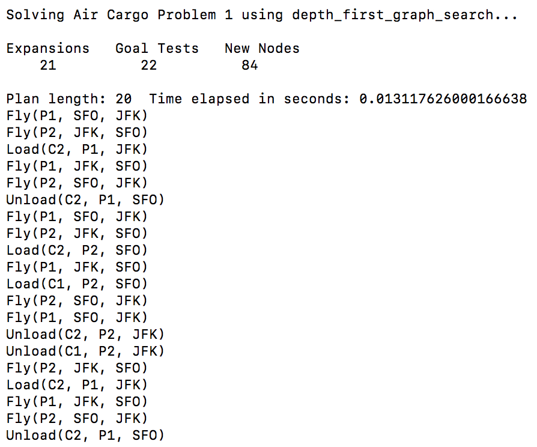
    - RESULT: Problem 1 - uniform cost search
    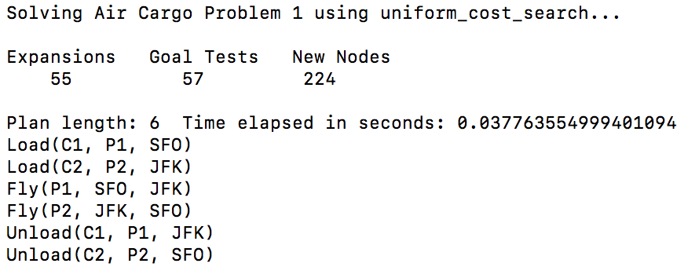
    - RESULT: Problem 1 - breadth first search
    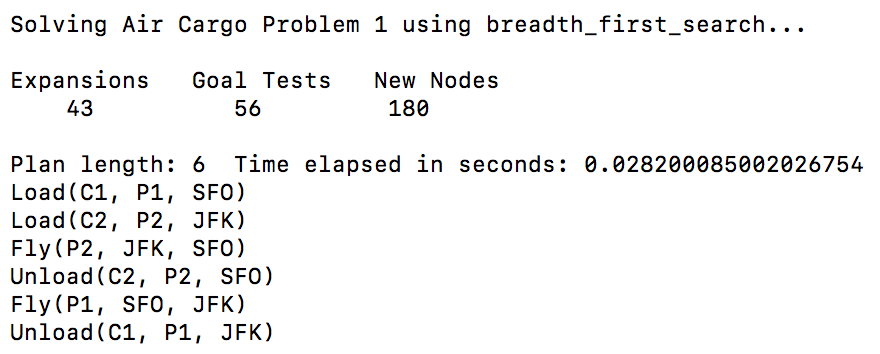          


- Problem 2 initial state and goal:
    ```
    Init(At(C1, SFO) ∧ At(C2, JFK) ∧ At(C3, ATL)
        ∧ At(P1, SFO) ∧ At(P2, JFK) ∧ At(P3, ATL) 
        ∧ Cargo(C1) ∧ Cargo(C2) ∧ Cargo(C3)
        ∧ Plane(P1) ∧ Plane(P2) ∧ Plane(P3)
        ∧ Airport(JFK) ∧ Airport(SFO) ∧ Airport(ATL))
    Goal(At(C1, JFK) ∧ At(C2, SFO) ∧ At(C3, SFO))
    ```
    - RESULT: Problem 2 - astar_search with h_1
    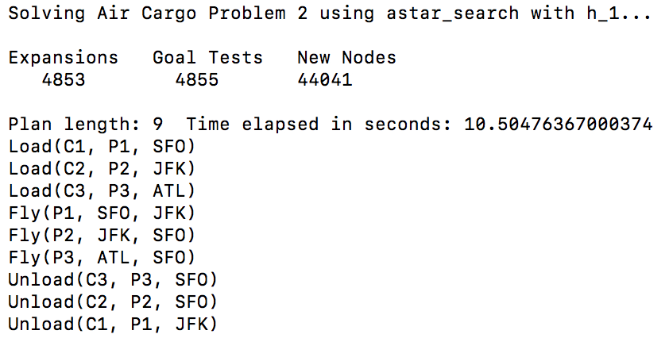  
    - RESULT: Problem 2 - uniform cost search
    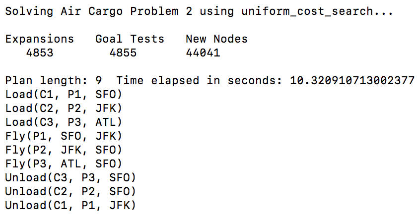
    - RESULT: Problem 2 - breadth first search
    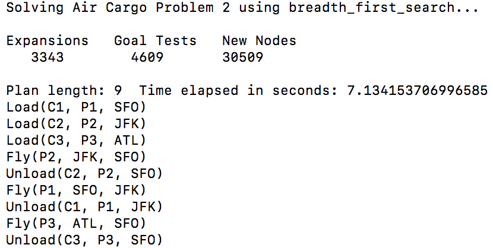    
    - RESULT: Problem 2 - depth first graph search
    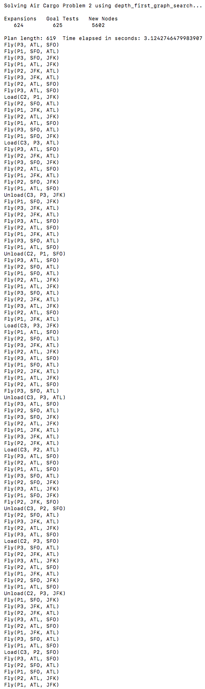
    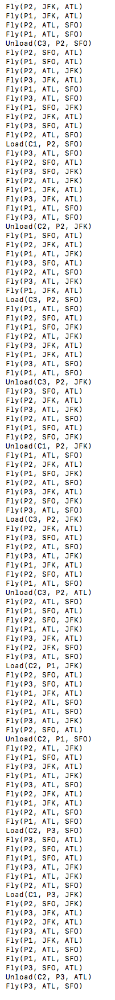
    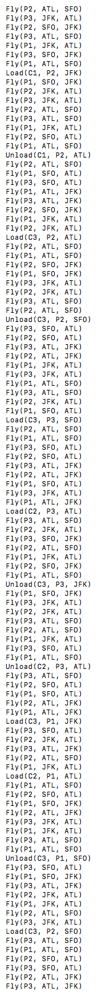
    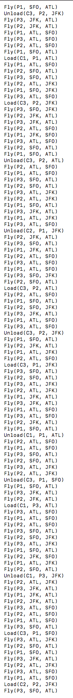
    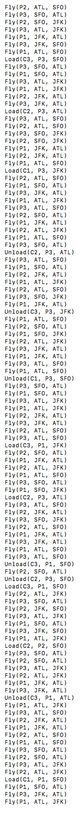
    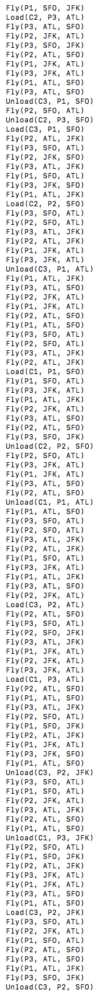              


- Problem 3 initial state and goal:
    ```
    Init(At(C1, SFO) ∧ At(C2, JFK) ∧ At(C3, ATL) ∧ At(C4, ORD)
        ∧ At(P1, SFO) ∧ At(P2, JFK)
        ∧ Cargo(C1) ∧ Cargo(C2) ∧ Cargo(C3) ∧ Cargo(C4)
        ∧ Plane(P1) ∧ Plane(P2)
        ∧ Airport(JFK) ∧ Airport(SFO) ∧ Airport(ATL) ∧ Airport(ORD))
    Goal(At(C1, JFK) ∧ At(C3, JFK) ∧ At(C2, SFO) ∧ At(C4, SFO))
    ```
    - RESULT: Problem 3 - astar_search with h_1
    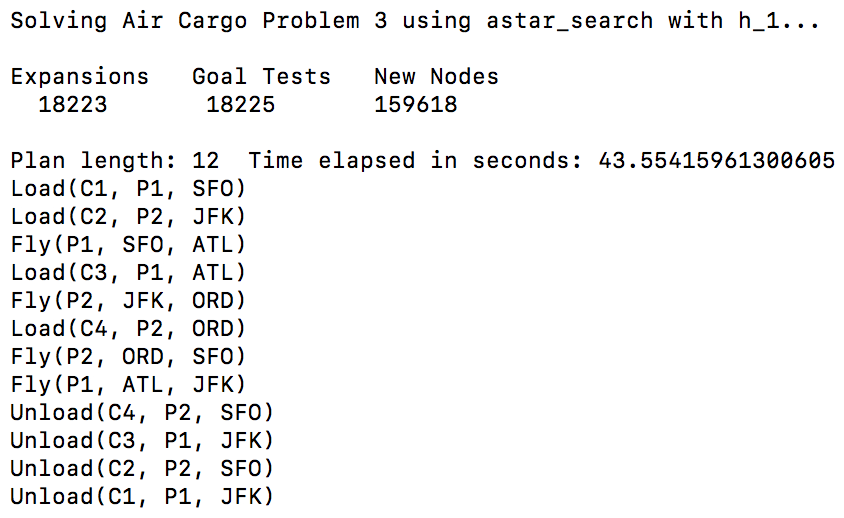  
    - RESULT: Problem 3 - uniform cost search
    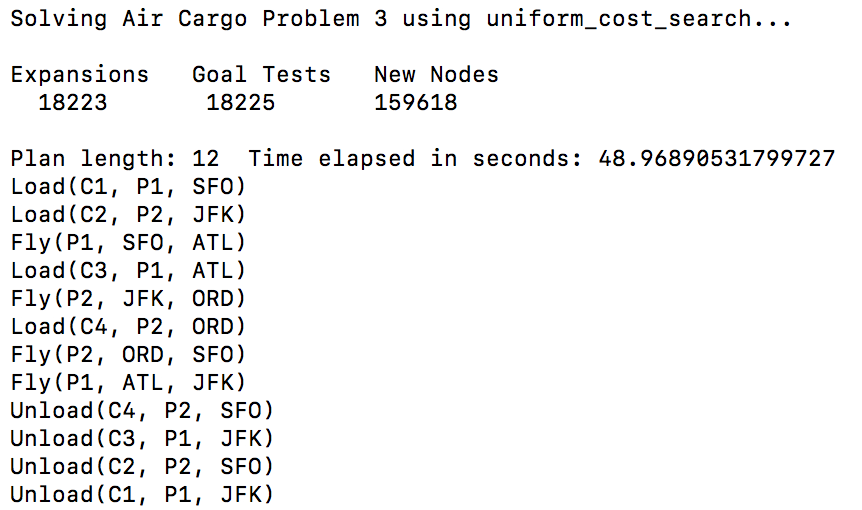
    - RESULT: Problem 2 - breadth first search
    
    - RESULT: Problem 3 - depth first graph search
    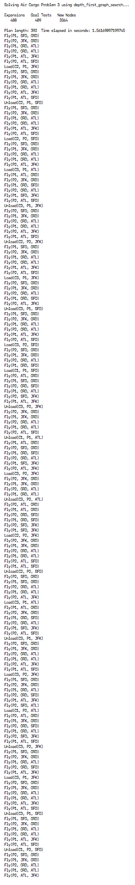
    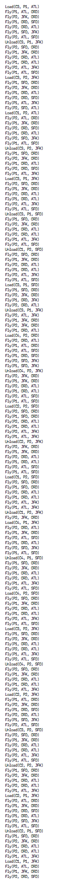
    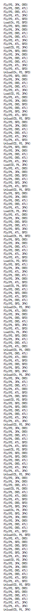    


## Comparing 3 uniformed planning algorithms & A*
- Problem 1:
    - Best perform: __breadth_first__
    - Key metrics comparing to the others algorithms: All algorithms, except the depth first, found the best solution
    (less actions), but breadth was the cheapest algorithm (expanded less nodes). The best solution had ~3x less actions
    than the depth first algorithm solution. All the key metrics (number of node expansions, goal tests & new nodes)
    were the same for astar & uniform, but astar was a little bit faster than the uniform_cost;
- Problem 2:
    - Best perform: __breadth_first__
    - Key metrics comparing to the others algorithms: All algorithms, except the depth first, found the best solution
    (less actions), but breadth was the cheapest algorithm (expanded less nodes). The best solution had ~68,77x than the
    depth first algorithm solution. All the key metrics (number of node expansions, goal tests & new nodes) were the
    same for astar & uniform, but uniform_cost_search was a little bit faster;
- Problem 3:
    - Best perform: __breadth_first__
    - Key metrics comparing to the others algorithms: All algorithms, except the depth first, found the best solution
    (less actions), but breadth was the cheapest algorithm (expanded less nodes). The best solution had ~32,66x than the
    depth first algorithm solution. All the key metrics (number of node expansions, goal tests & new nodes) were the
    same for astar & uniform, but uniform_cost_search was a little bit faster;        


## Comparing A* with level-sum & ignore-preconditions
Key Metrics: Expansions; Goal Test; New Nodes; Plan Length (solution); Spent Time.


### Problem 1 Table
| Tables                 | Expan.     | Goal Tests | New Nodes | Plan Length | Spent Time |
|------------------------|:----------:|-----------:|-----------|-------------|------------|
| astar                  |    4853    |     57     |    224    |      6      | 0.030      |
| h_levelsum             |     11     |     13     |     50    |      6      | 0.551      |
| h_ignore_preconditions |     41     |     43     |    170    |      6      | 0.030      |

For the Problem1, about the time to take a decision, the A* was the best algorithm, but about the less expansion metric
the best algorithm was the levelsum. Selecting a "middle term", the best was the ignore_predictions, that found the
solution using a bit more time than the A* and expanding a bit more, comparing to levelsum.    

### Problem 2 Table
| Tables                 | Expan.     | Goal Tests | New Nodes | Plan Length | Spent Time |
|------------------------|:----------:|-----------:|-----------|-------------|------------|
| astar                  |    4853    |    4855    |   44041   |      9      | 11.131     |
| h_levelsum             |     86     |     88     |    841    |      9      | 44.135     |
| h_ignore_preconditions |    1450    |    1452    |   13303   |      9      | 4.4341     |

For the Problem2, about the time to take the best decision, the ignore_predictions was the best algorithm, but about the
one that less expanded, the winner was the levelsum, but it took so long time to find the solution.

### Problem 3 Table
| Tables                 | Expan.     | Goal Tests | New Nodes | Plan Length | Spent Time |
|------------------------|:----------:|-----------:|-----------|-------------|------------|
| astar                  |    18223   |    18225   |   159618  |      12     | 49.961     |
| h_levelsum             |     325    |     327    |    3002   |      12     | 234.37     |
| h_ignore_preconditions |    5040    |    5042    |   44944   |      12     | 18.444     |

For the Problem3, about the time to take the best decision, the ignore_predictions was the winner algorithm, but about 
the one that less expanded, the winner was the levelsum, but it took so long time to find the solution.

As a result is clear that the levelsum use less visits/expansions, but it logics takes so much longer to execute, so it
is not so efficiently, the ignore_predictions, instead, perform more expansions, but it logic is so "time-cheap".

## Reason for each result
The depth first grown up it expansion of nodes exponentially, getting worse for each problem. According to the classes
videos, it is caused by the search algorithm which search in the depth level for each branch, taking a long way to the
solution. The breadth first was the best because it only consider the shortest path instead of the cheapest total cost,
this way it expanded less nodes & got the answer faster than the A* and the Uniform Cost.
